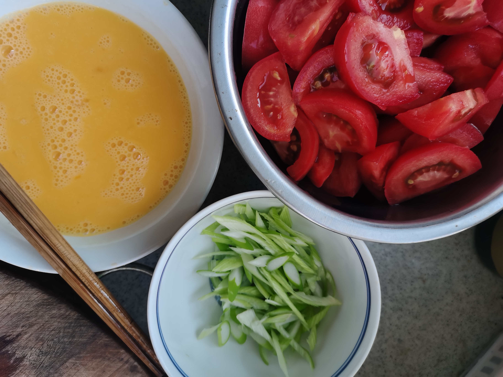
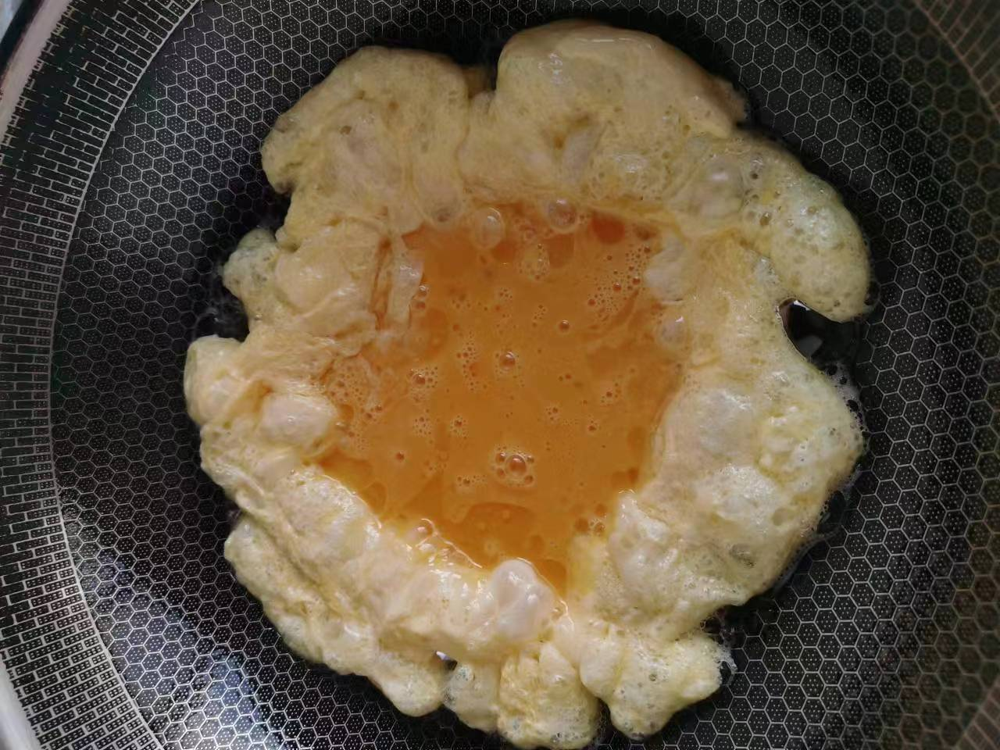
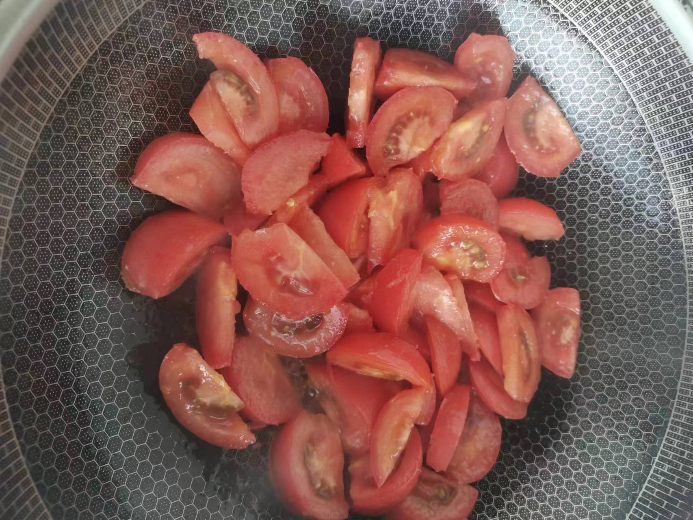
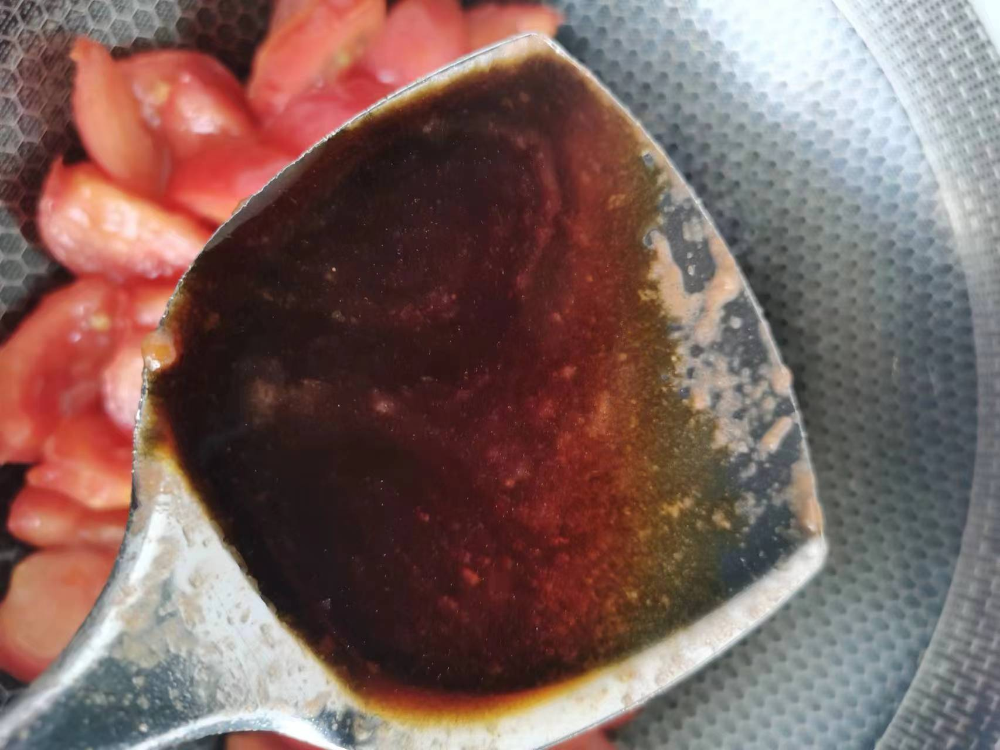
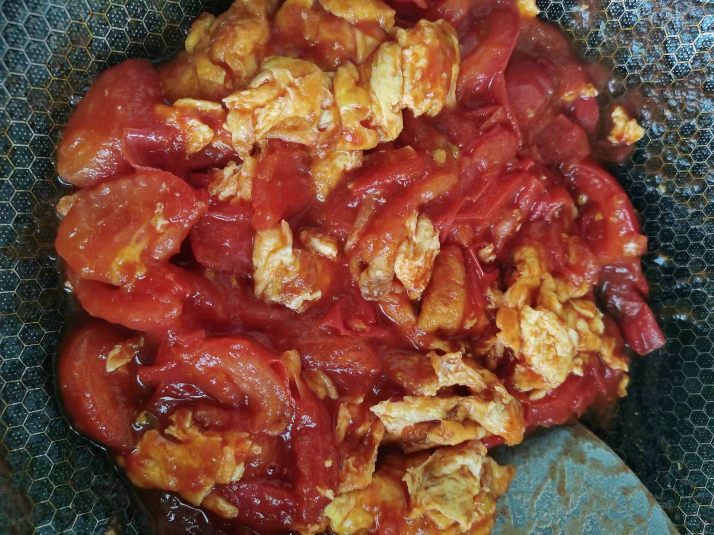

# 西红柿炒鸡蛋

## 所需材料

* 西红柿（3到4个），鸡蛋（2到3个）
* 葱（小葱1根或大葱0.5根）
* 白醋，盐，生抽酱油

## 步骤

1. 处理食材。
    1. 将西红柿去蒂切块，不要切太小（炒出来的西红柿还是希望是成形的，不希望炒成番茄酱，所以不要切太小），放入碗中备用。
    1. 鸡蛋打入碗中，加入0.5瓶盖白醋，少许盐，（白醋的作用去腥，盐的作用让鸡蛋均匀有底味）搅散备用。
    1. 葱花切小段备用。（大葱可以剖成两半斜切成薄片，小葱直接切小段）

     
    

1. 炒鸡蛋。
    1. 锅中放适量油，开大火，将油烧热，直至冒出油烟，下入搅散的鸡蛋液，不要用锅铲去搅动鸡蛋，让油温将其烧成形。
    1. 同时手握锅把手将锅倾斜角度转动，让上部中间还未成形的蛋液流到锅边使其成形。
    1. 这时候鸡蛋底部应该有微微的变色了，用锅铲翻面，将另一面也煎至微微变色，然后捞出备用。(鸡蛋烧至变色微焦的原因是因为西红柿出水多，所以鸡蛋不能太嫩，这样口感好)

     
    
    
    

1. 炒西红柿。
    1. 锅中放适量油，开大火，油烧热至冒烟，下入之前下好的葱花爆香，这时立马放入西红柿翻炒。（葱花放入后两秒左右就立马放西红柿，因为油已经烧热，时间再长葱花就烧焦了）
    1. 翻炒片刻加入两锅铲的生抽酱油（加入生抽酱油是为了让西红柿炒出来不那么酸），然后继续翻炒使酱油均匀。
    1. 然后停止翻炒，加入适量盐，然后倒入刚才炒好的鸡蛋，翻炒均匀即可出锅。

     
    
    
    

## 技术总结

* 蛋液中加入白醋和盐，去腥和加底味。
* 鸡蛋烧至微焦，不要太嫩，否则口感不好。
* 炒西红柿前先葱花爆香，个人觉得葱香比蒜香的西红柿味道更好，炒西红柿加入生抽降低酸味。
