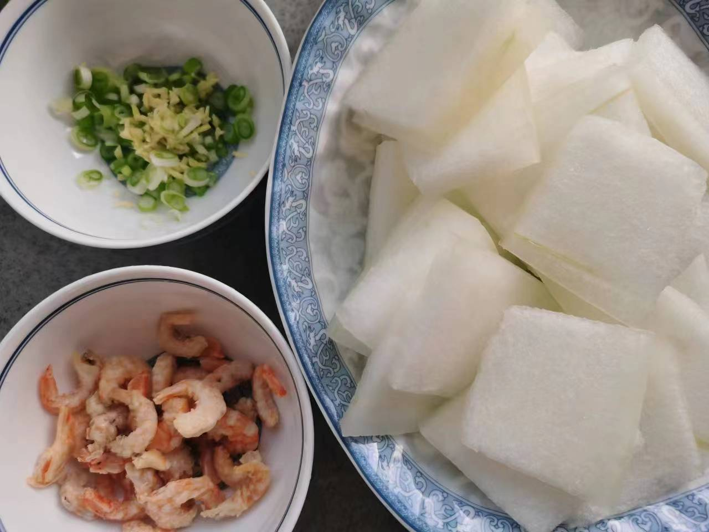
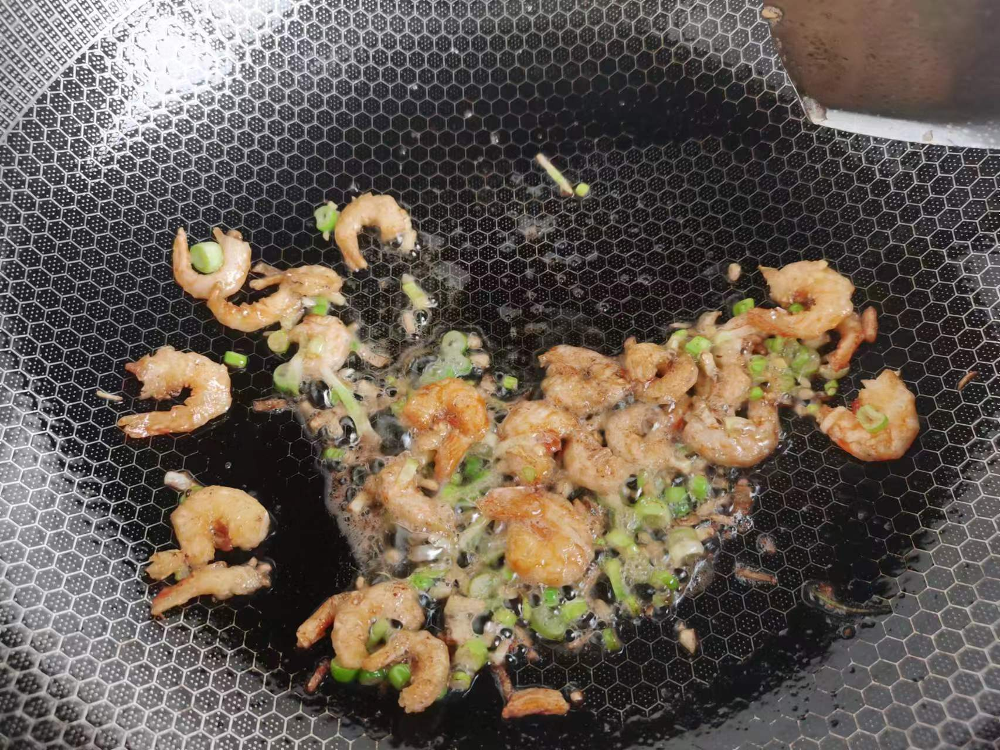
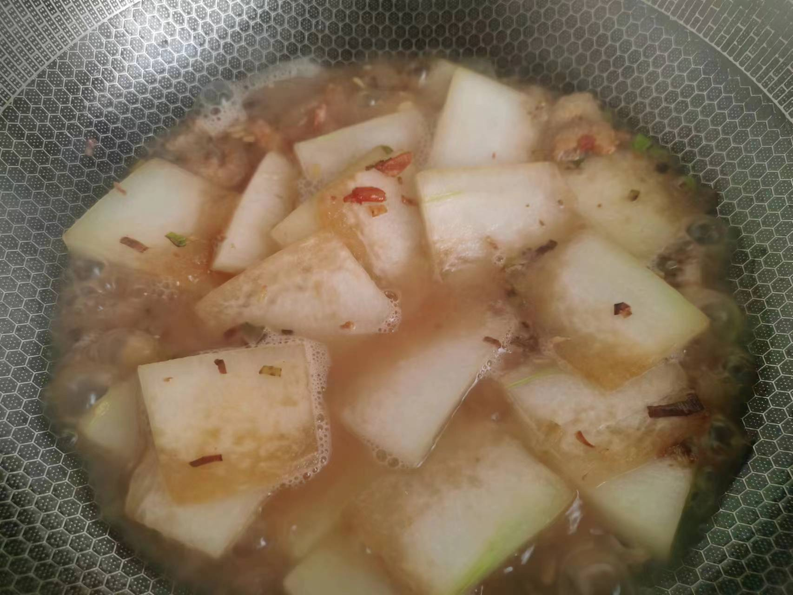
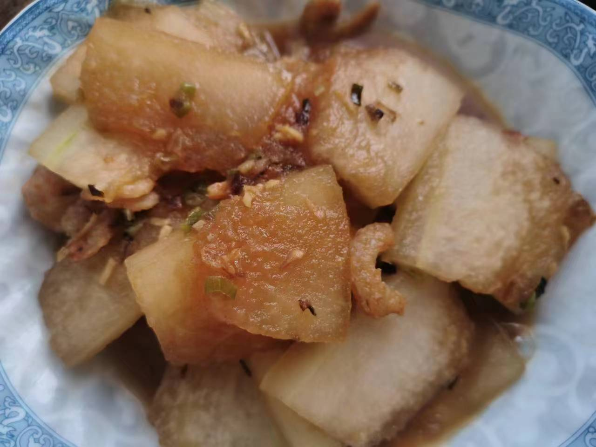

# 烧冬瓜

## 所需材料

* 冬瓜1块，海米1把
* 葱0.5根，姜1块
* 料酒，生抽酱油，盐

## 步骤

1. 处理食材。
    1. 冬瓜去皮切片，不要太薄也不要太厚。
    1. 海米泡一会儿水，沥干备用。
    1. 葱切葱花，姜切末备用。

     
    
    

1. 炒菜。
    1. 起锅烧油，油热时下海米，同时下入半瓶盖料酒去腥，翻炒两下加入葱姜翻炒，然后下冬瓜片翻炒，加入半锅铲生抽酱油，翻炒片刻后加入热水没过冬瓜
    1. 大火将水收干，放入适量盐即可出锅。

     
    
    

## 技术总结

* 加料酒为虾米去腥
* 酱油不要放太多，否则颜色就变黑了
