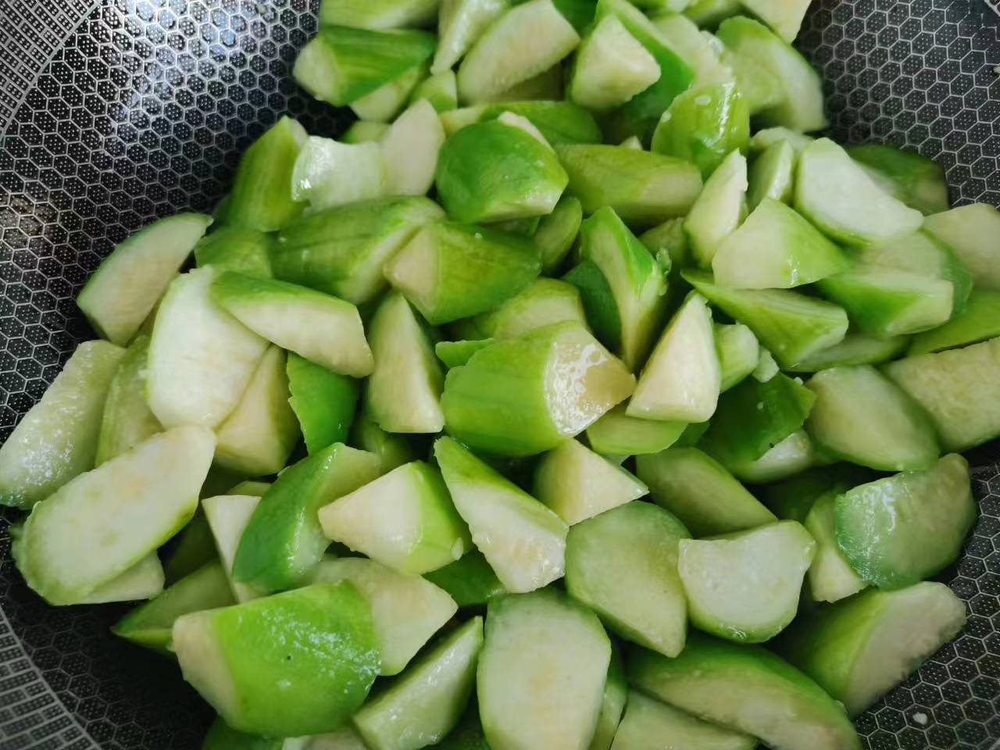
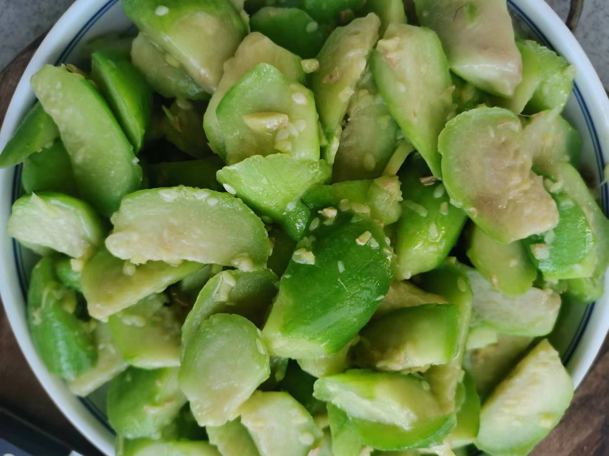

# 清炒丝瓜

## 所需材料

* 丝瓜1根
* 姜1块
* 盐

## 步骤

1. 处理食材。
    1. 丝瓜切滚刀块，不要切太大
    1. 姜切末，姜多一点（丝瓜寒性，所以放姜）

2. 炒菜。
    1. 起锅烧油，油热后关小火，然后下丝瓜，反复小火翻炒，煸炒长时间后，丝瓜会炒出粘液，并且白色慢慢变成灰色，这时候下姜末继续翻炒，然后放入适量盐即可出锅

     
    
    

## 技术总结

* 丝瓜小火炒，因为丝瓜虽然会出水但是并不多，大火容易烧焦
* 丝瓜寒性，所以放姜

