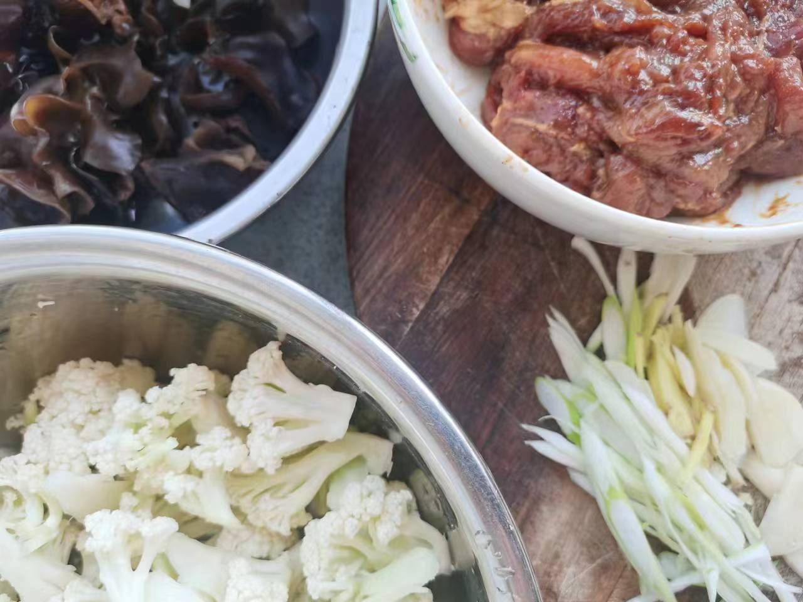
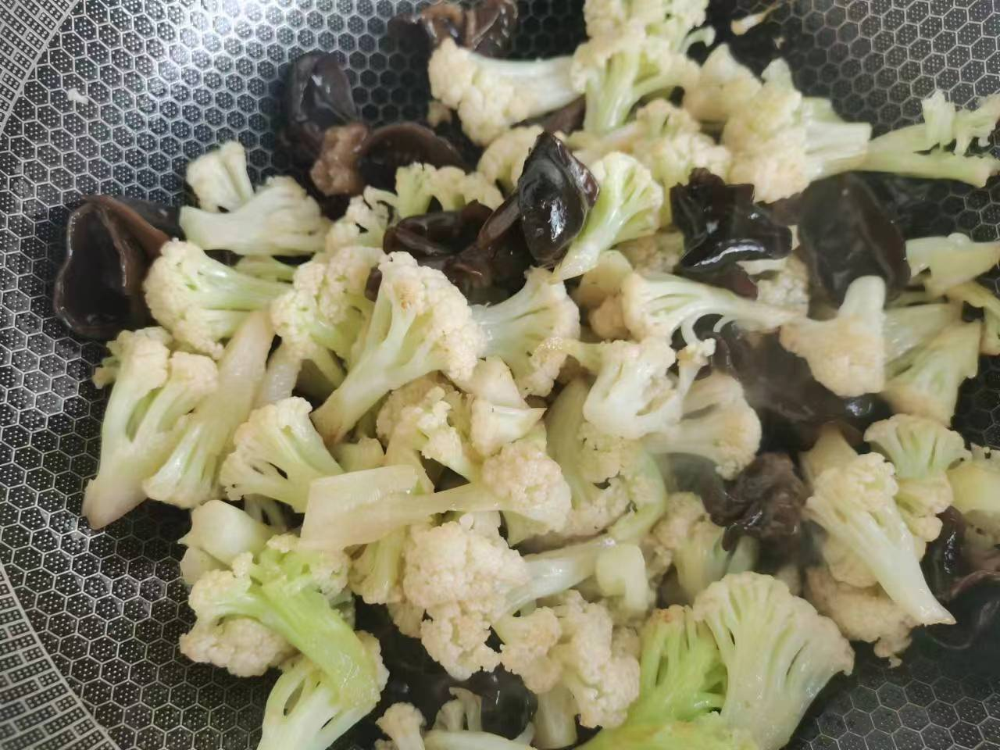
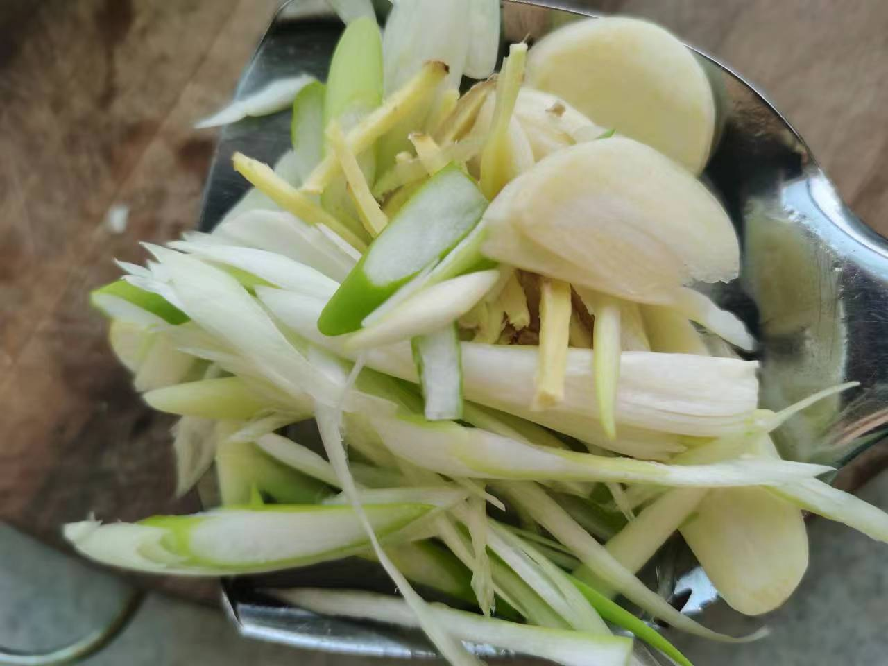
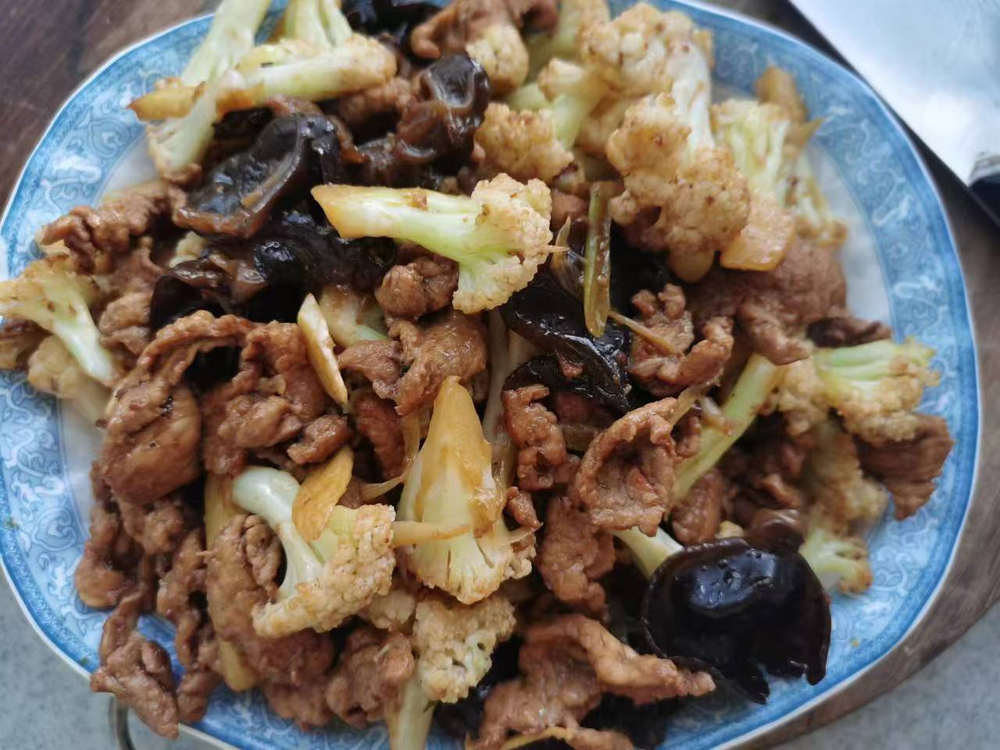

# 花菜炒肉

## 所需材料

* 猪里脊200g，木耳若干，花菜1颗
* 葱0.5根，姜1块，蒜4到5颗
* 盐，胡椒粉，老抽酱油，料酒，淀粉

## 步骤

1. 处理食材。
    1. 猪肉切薄肉片，尽量切薄，然后放入碗中。碗中一次加入盐（1勺），胡椒粉（3勺，可以多一些），老抽酱油（1小勺），料酒（1瓶盖），然后带一次性手套不停用力抓拌，直至肉片开始成粘稠状，然后加入淀粉，再次抓匀，最后加入食用油，然后抓匀备用。（加入盐是为了加底味，胡椒粉是为了去腥，老抽是为了上色，料酒去腥，淀粉是为了使肉滑嫩，最后加入食用油为了锁住水分）
    1. 花菜用手掰成小块，然后用剪刀葱茎部朝上切成更小的块
    1. 木耳泡发洗净沥干水备用
    1. 葱剖开斜切成条，蒜切片，姜切片

     
    

1. 炒菜。
    1. 锅中放油烧热，下入菜花不断翻炒，然后下入木耳，炒至花菜茎部透明断生捞出备用
    1. 锅中放更多的油，烧热，下入肉片滑散，然后下葱姜蒜，翻炒一会儿后立即下入花菜和木耳，翻炒均匀，加入适量盐翻炒即可出锅

     
    
    
    

## 技术总结

* 炒肉油多一点，避免粘锅。肉片翻炒，不可炒时间太长，否则会发柴影响口感。
