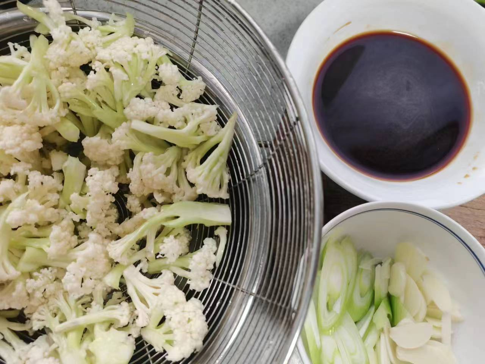
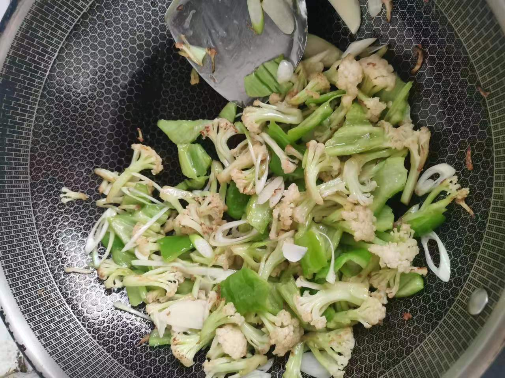
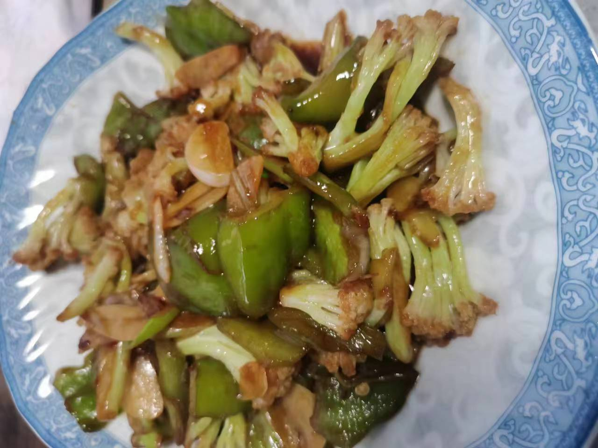

# 炒花菜

## 所需材料

* 花菜1朵，青椒红椒各1个
* 大葱0.5根，蒜4颗
* 盐，蚝油，生抽酱油，淀粉

## 步骤

1. 处理食材。
    1. 先用手将花菜掰成大块，然后用剪刀顺着小朵花菜的茎往上剪成小朵（尽量剪成小朵，这样受热面积大，更容易炒熟），然后将花菜放入凉水浸泡，水中加入一勺食盐（加入食盐可以帮助杀死虫卵），浸泡一段时间后沥水捞出备用。
    2. 青红椒切丝备用。葱蒜切薄片备用。
    3. 拿一个碗，依次加入盐（1勺），蚝油（2勺），生抽酱油（2勺），淀粉少许，再加入少许凉水，搅拌均匀备用。

     
    

2. 炒花菜。
    1. 锅中放油，烧热至冒烟，倒入花菜翻炒，直至花菜茎部呈透明状。
    2. 这时候转至中小火，放入葱蒜，稍微翻炒一下。（如果有青红椒，这时候放入翻炒即可）
    3. 倒入刚才调好的调料汁，大火翻炒均匀即可出锅。

     
    
    

## 技术总结

* 花菜用剪刀切小朵，容易炒熟。
* 调料汁提前准备好，因为花菜炒至透明时很快就会熟，调料汁直接倒入速度快，避免花菜炒软，这样能炒出很脆的效果。
* 调料汁里的淀粉少量即可，打薄芡。
