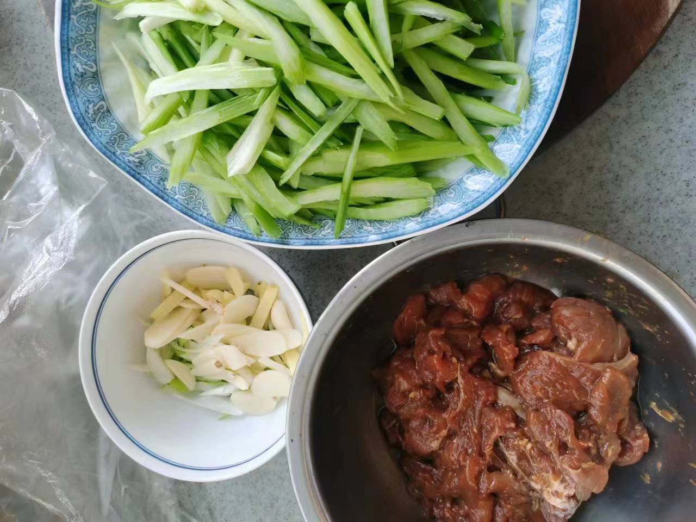
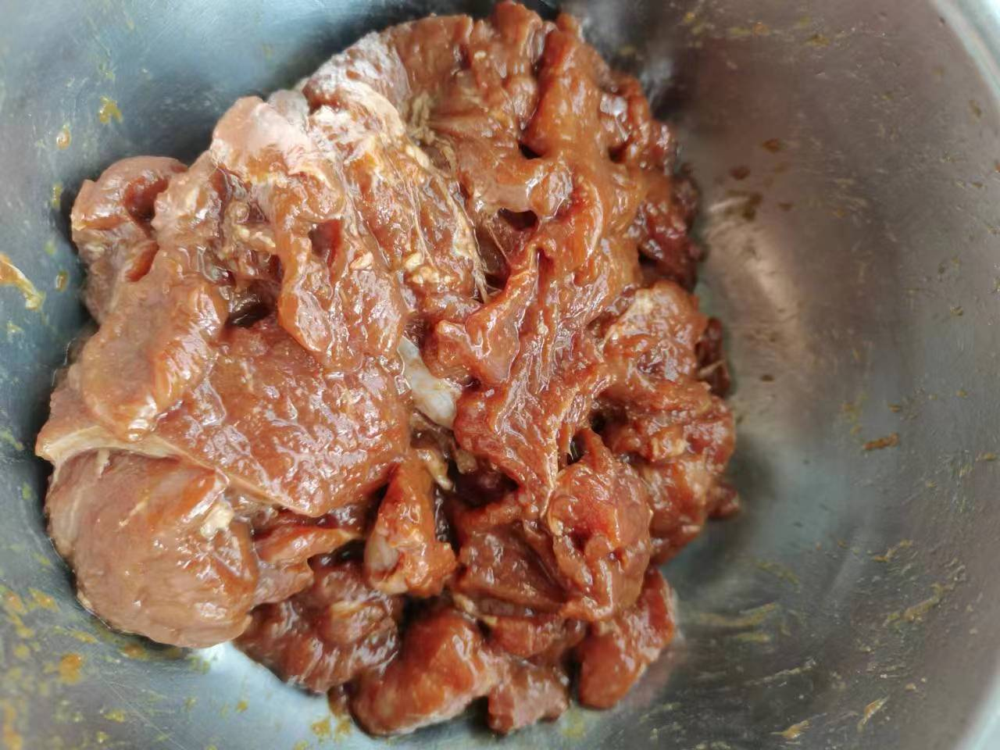
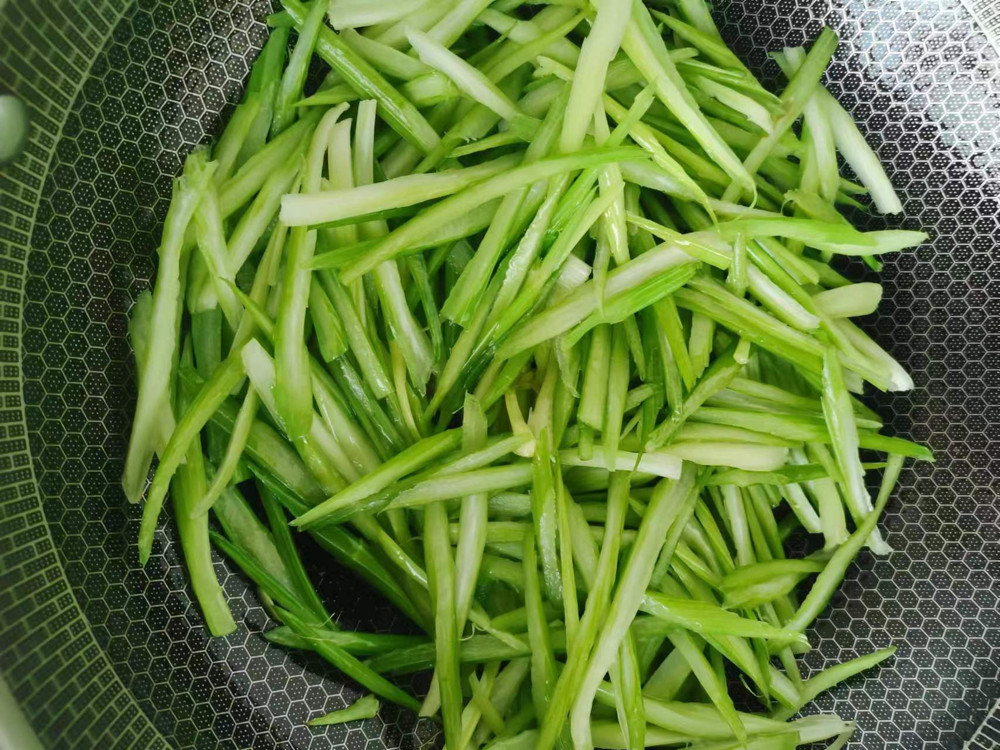
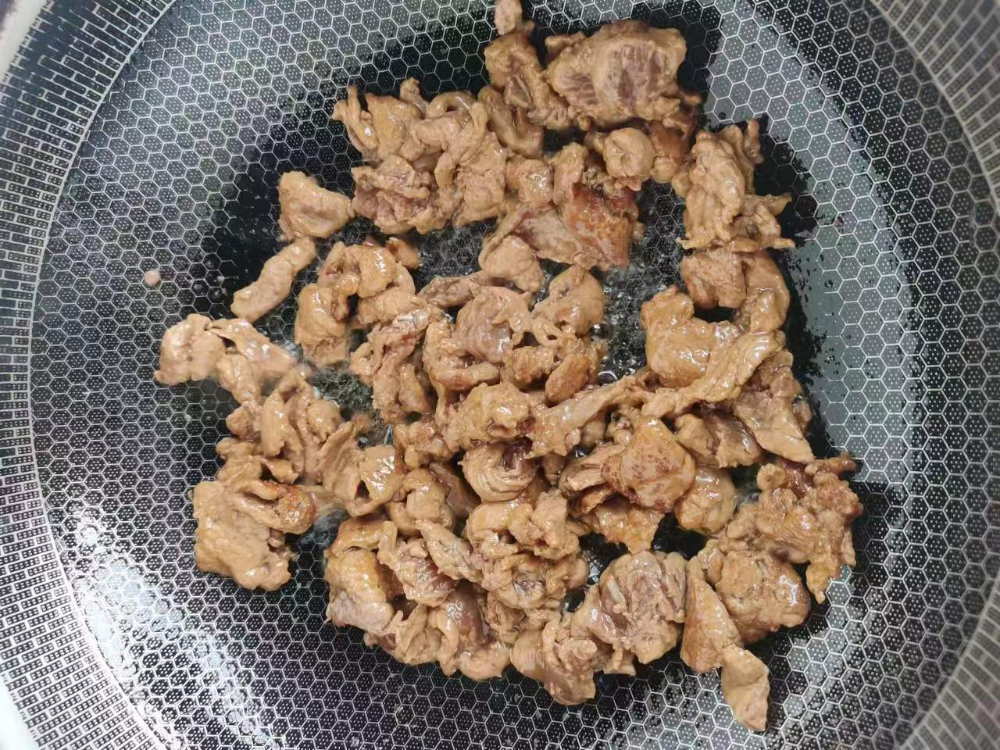
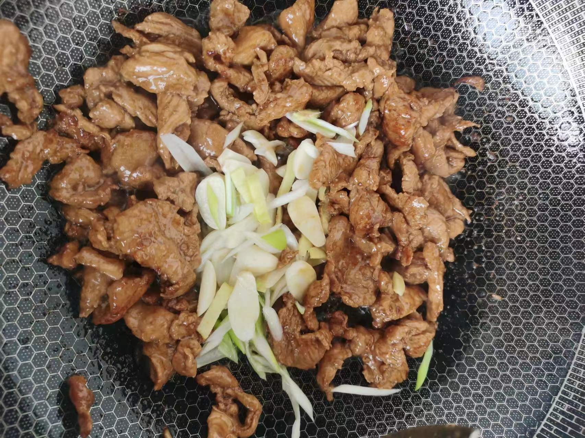
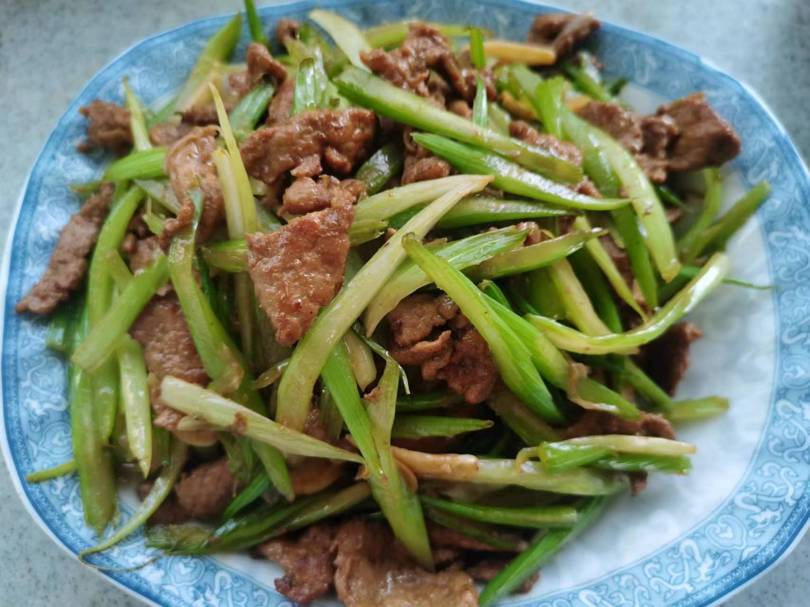

# 芹菜炒肉

## 所需材料

* 芹菜2到3根，猪瘦肉200g
* 葱1根，蒜4到5个，姜1小块
* 盐，胡椒粉，老抽酱油，料酒，淀粉

## 步骤

1. 处理食材。
    1. 芹菜斜刀切长一点的薄片（长薄片受热面积更大）放碗中备用。
    1. 猪肉切薄肉片，尽量切薄，然后放入碗中。碗中一次加入盐（1勺），胡椒粉（3勺，可以多一些），老抽酱油（1小勺），料酒（1瓶盖），然后带一次性手套不停用力抓拌，直至肉片开始成粘稠状，然后加入淀粉，再次抓匀，最后加入食用油，然后抓匀备用。（加入盐是为了加底味，胡椒粉是为了去腥，老抽是为了上色，料酒去腥，淀粉是为了使肉滑嫩，最后加入食用油为了锁住水分）
    1. 葱姜蒜切薄片放入碗中备用。

     
    
    

2. 炒菜。
    1. 锅中放油烧热至冒烟，倒入芹菜，翻炒时加一点盐留底味，片刻即可捞出备用。
    2. 锅中放油，可以多一点（炒肉油多防止粘锅，转动锅让锅四周都布满油，以防粘锅），倒入腌好的猪肉，大火迅速将肉滑散，炒至肉片变色，然后锅中淋入一锅铲生抽酱油，然后翻炒一会，加入葱姜蒜，继续翻炒。
    3. 最后将芹菜回锅，加入少许盐，大火翻炒均匀即可出锅。

     
    
    
    
    

### 技术总结

* 肉片腌制是重点，加入盐是为了加底味，胡椒粉是为了去腥，料酒为了去腥，老抽是为了上色，淀粉是为了使肉滑嫩，最后加入食用油为了锁住水分。一定要将肉抓拌至粘稠状，这样调料才能充分融合。
* 炒肉片油多一点，避免粘锅。
