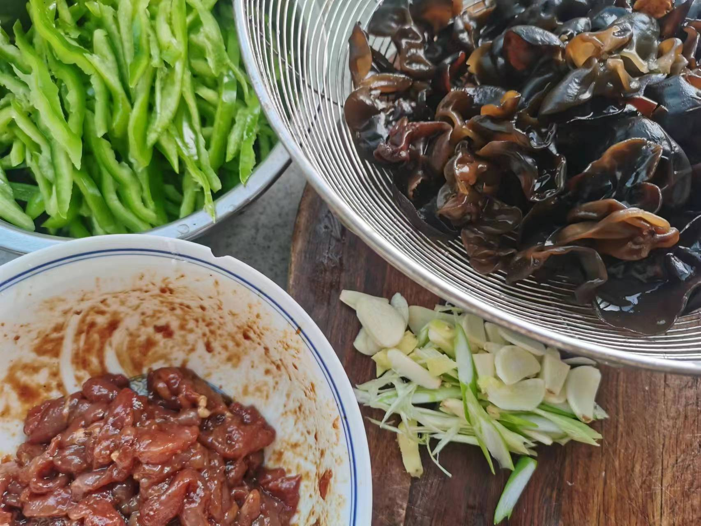
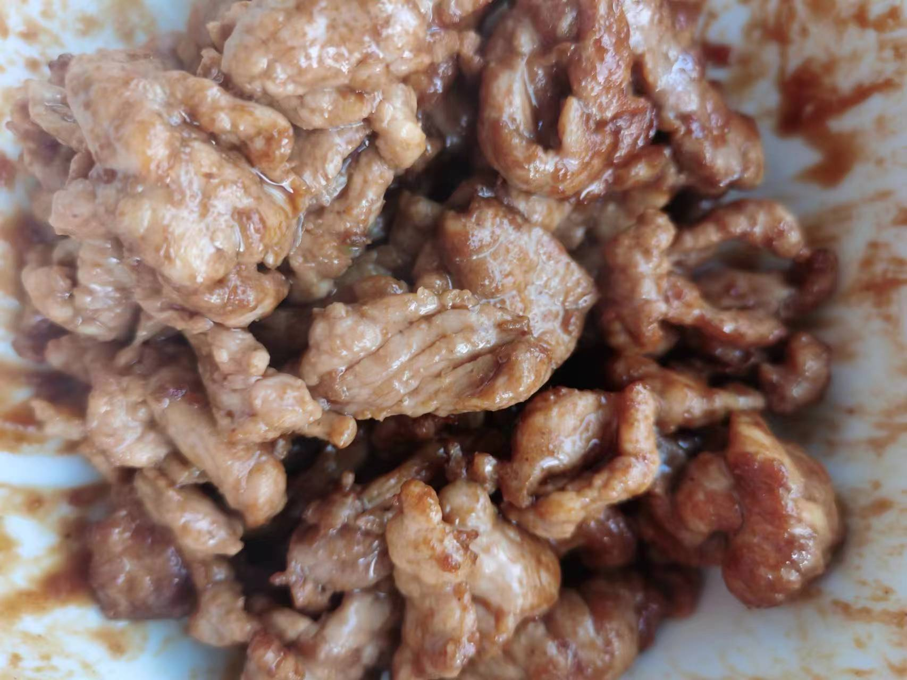
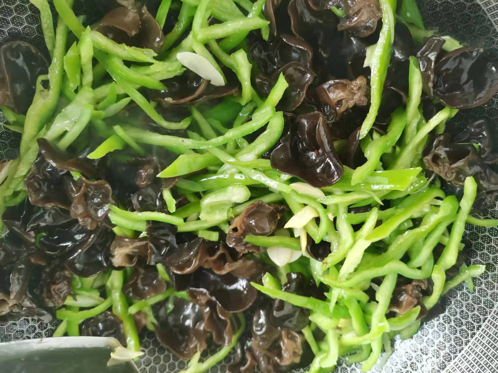
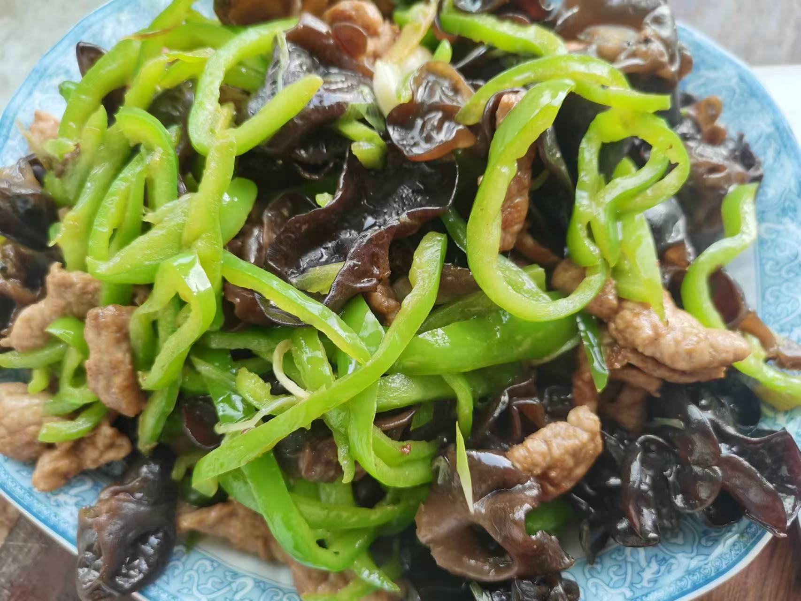

# 木耳青椒炒肉

## 所需材料

* 木耳若干，青椒2到3个，猪瘦肉200g
* 葱0.5根，蒜4到5个，姜1小块
* 盐，胡椒粉，老抽酱油，料酒，淀粉

## 步骤

1. 处理食材
    1. 青椒去籽，切丝备用。
    1. 木耳泡发洗净备用。
    1. 猪肉切薄肉片，尽量切薄，然后放入碗中。碗中一次加入盐（1勺），胡椒粉（3勺，可以多一些），老抽酱油（1小勺），料酒（1瓶盖），然后带一次性手套不停用力抓拌，直至肉片开始成粘稠状，然后加入淀粉，再次抓匀，最后加入食用油，然后抓匀备用。（加入盐是为了加底味，胡椒粉是为了去腥，老抽是为了上色，料酒去腥，淀粉是为了使肉滑嫩，最后加入食用油为了锁住水分）
    1. 葱破成两半斜切成丝，蒜切片，姜切片备用

     
    

1. 炒菜
    1. 锅中放油，可以多一点（炒肉油多防止粘锅，转动锅让锅四周都布满油，以防粘锅），倒入腌好的猪肉，大火迅速将肉滑散，炒至肉片变色捞出备用。（这一步大火迅速翻炒出锅，以防肉片水分炒干）
    1. 刚才放的油多，这时候就不需要再加油，烧热后下入葱姜蒜爆香，立即下入青椒翻炒一下，然后下入木耳继续翻炒，然后将刚才炒好的肉片回锅继续翻炒，加入适量盐炒匀即可出锅。

     
    
    
    

## 技术总结

* 炒肉油多一点，避免粘锅。肉片翻炒快速出锅，不可炒时间太长，否则会发柴影响口感。
