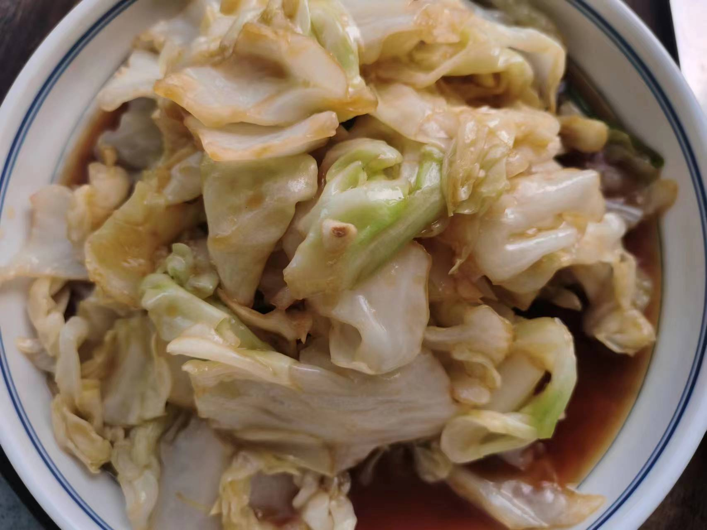

# 蚝油包菜

## 所需材料

* 包菜1颗
* 大葱0.5根，蒜4到5颗
* 盐，蚝油，生抽酱油

## 步骤

1. 处理食材。
    1. 包菜洗干净，然后用手将包菜叶子撕成小块备用。
    1. 大葱用刀劈成两半切小段葱花，蒜拍一下切碎，然后葱和蒜放小碗里备用。

     
    

1. 炒包菜。
    1. 起锅下油，油热后放入葱和蒜爆香，然后下入包菜，翻炒均匀。
    1. 待包菜炒软了，放调料。盐（1勺），蚝油（2大勺），生抽（1锅铲），然后翻炒均匀出锅装盘。

     
    

## 技术总结

* 包菜出水较多，可以考虑最后打一个薄芡，也可以不打。
* 这道菜做法和蚝油生菜一样，只是蔬菜换成了包菜。
