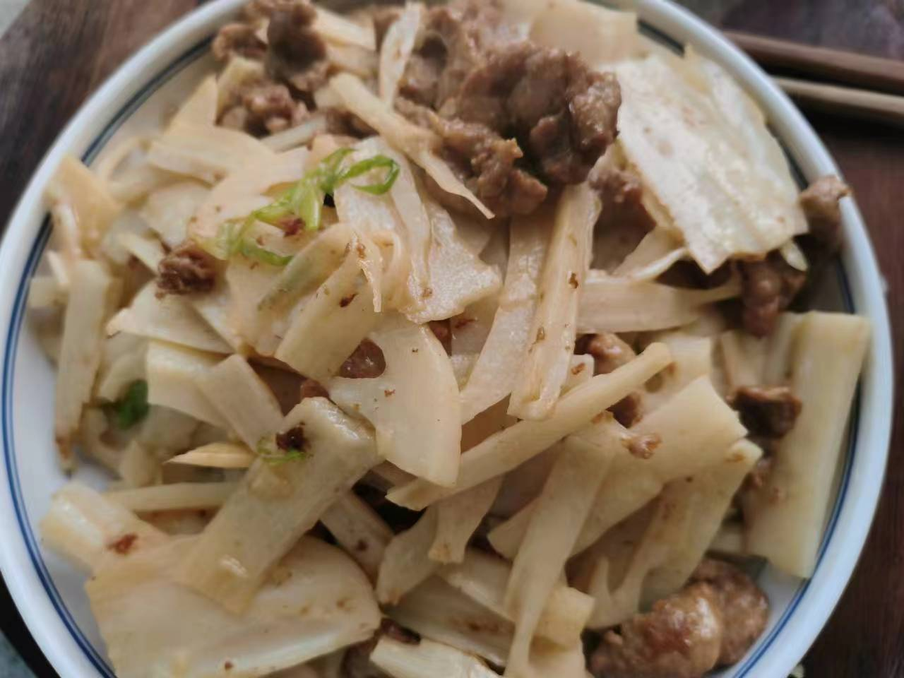

# 藕片炒肉

## 所需材料

* 藕1节，猪瘦肉200g
* 葱0.5根，姜1小块
* 盐，胡椒粉，老抽酱油，料酒，淀粉，白醋

## 步骤

1. 处理食材。
    1. 藕先切成2段或3段，然后立起剖开，然后切薄片，然后泡入水中备用。烧一锅水，水开下入藕片焯水，20到30秒即可，不宜时间过长，焯水的目的是为了去除多余的淀粉，防止炒菜时粘稠。焯水后放入干净的冷水中，然后沥水备用。
    1. 猪肉切薄肉片，尽量切薄，然后放入碗中。碗中一次加入盐（1勺），胡椒粉（3勺，可以多一些），老抽酱油（1小勺），料酒（1瓶盖），然后带一次性手套不停用力抓拌，直至肉片开始成粘稠状，然后加入淀粉，再次抓匀，最后加入食用油，然后抓匀备用。（加入盐是为了加底味，胡椒粉是为了去腥，老抽是为了上色，料酒去腥，淀粉是为了使肉滑嫩，最后加入食用油为了锁住水分）
    1. 葱姜切薄片放入碗中备用。

     
    
    
    

1. 炒菜。
    1. 锅中放油，可以多一点（炒肉油多防止粘锅，转动锅让锅四周都布满油，以防粘锅），倒入腌好的猪肉，大火迅速将肉滑散，炒至肉片变色捞出备用。
    1. 刚才放的油多可以不用加油，油烧热，下入葱姜爆香，立即下入藕片翻炒两下，加入半瓶盖白醋，继续翻炒。
    1. 炒好的肉片回锅一起翻炒，然后加入适量盐炒匀即可出锅。

     
    
    

## 技术总结

* 藕片需要焯水去除多余淀粉
* 炒肉油多一点，避免粘锅。肉片翻炒快速出锅，不可炒时间太长，否则会发柴影响口感。
