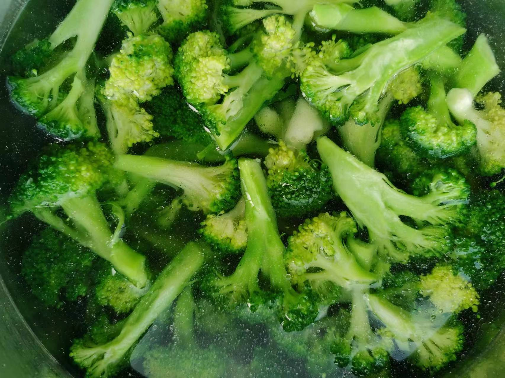
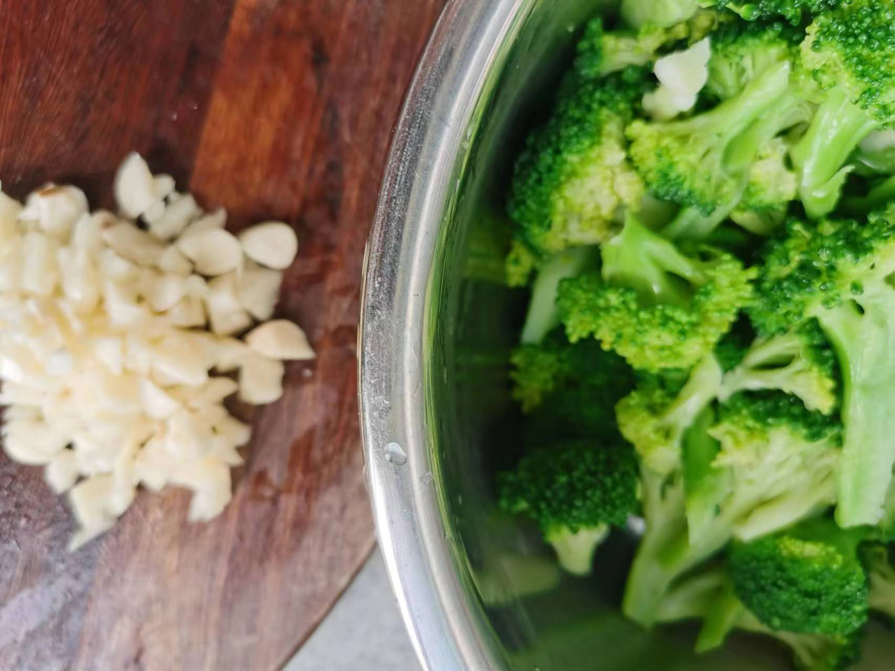
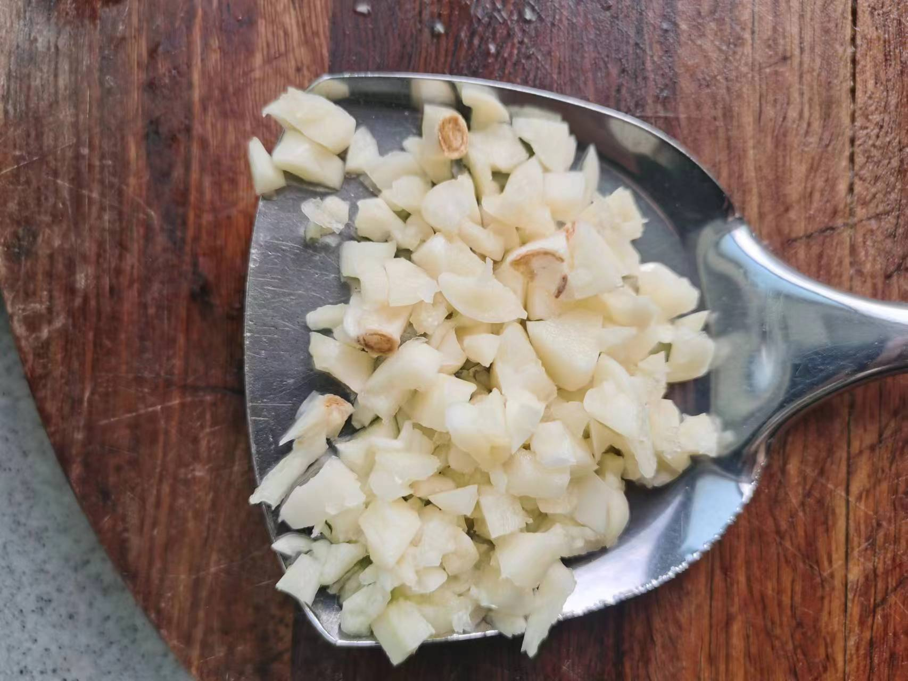
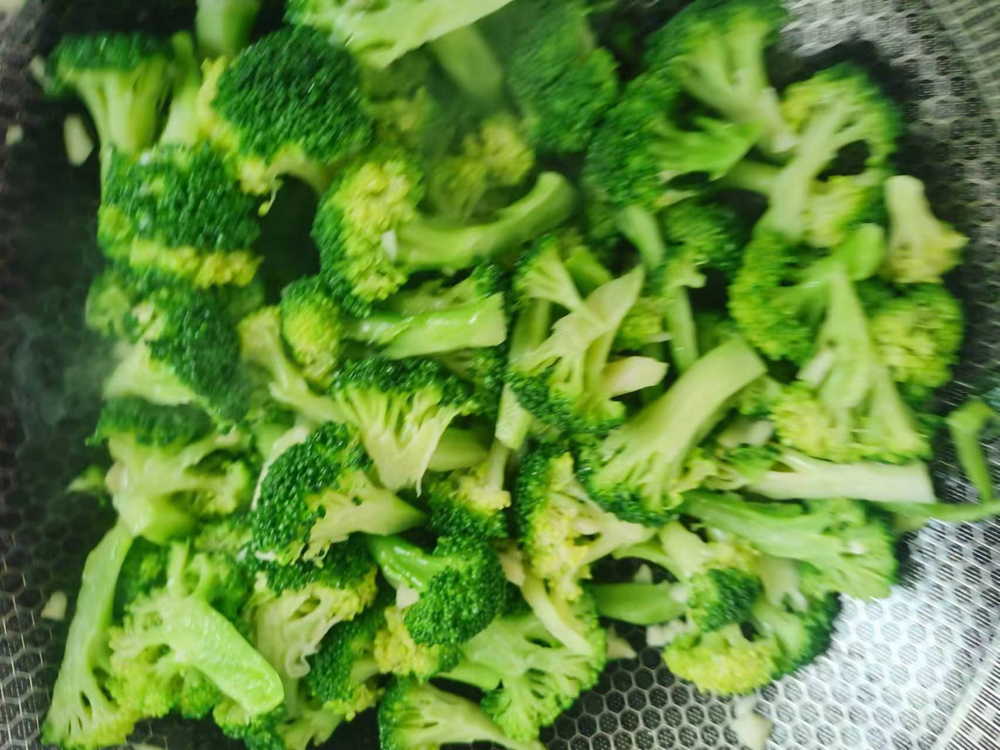
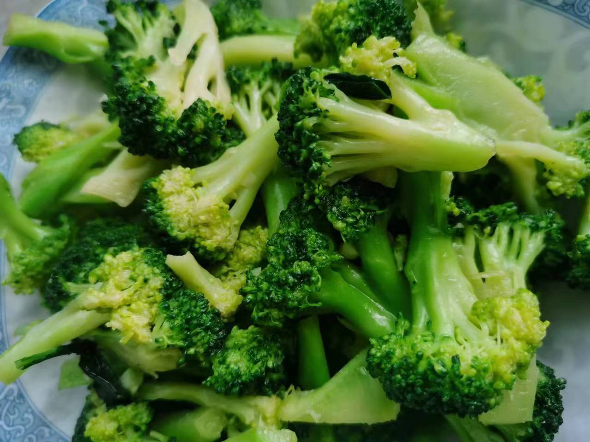

# 清炒西兰花

## 所需材料

* 西兰花1颗
* 蒜4到5颗
* 盐，生抽酱油

## 步骤

1. 处理食材。
    1. 先用手将西兰花掰成大块，然后用剪刀顺着小朵西兰花的茎往上剪成小朵（尽量剪成小朵，这样受热面积大，更容易炒熟），然后将西兰花放入凉水浸泡，水中加入一勺食盐（加入食盐可以帮助杀死虫卵）。然后烧一锅开水，放入西兰花焯水（加入一勺盐，倒入少许食用油，这一步是为了让西兰花翠绿），焯水时间不宜过长，水开放入大概20秒即可捞出，放入清水中过一下然后沥水备用。
    1. 蒜切碎备用。

     
    
    

1. 炒菜。
    1. 起锅烧油，油热后下入蒜爆香，立即下入西兰花翻炒，然后加入少许生抽酱油（一点点就可以），然后加入适量盐，炒匀出锅。

     
    
    
    

## 技术总结

* 西兰花焯水加入盐和食用油可以使西兰花翠绿，焯水时间不宜过长，否则最后口感不爽脆。
